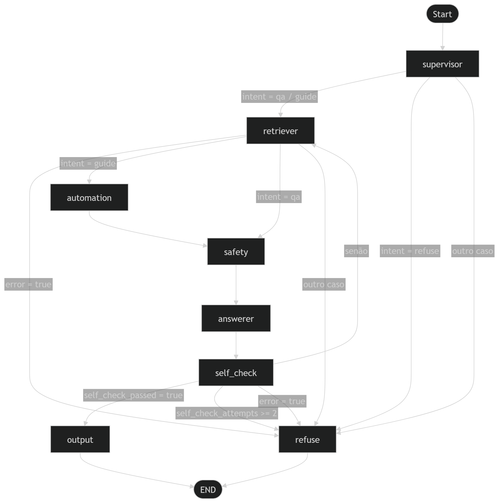

# LitGraph

## Sobre o app
O sistema tem como objetivo democratizar o acesso a obras literárias clássicas do domínio público, gerando guias de estudo personalizados de acordo com o nível do aluno ou responder perguntas avulsas com base nas obras. A ideia central é que um estudante do ensino médio, um professor preparando uma aula ou um leitor curioso possa obter, em segundos, um material estruturado sobre qualquer obra disponível no Project Gutenberg com resumo, personagens, temas, trechos-chave e perguntas de revisão, tudo embasado em evidências reais do texto original, sem alucinações.

## Usecases principais
### UC-01 — Gerar guia de estudo completo
O caso de uso principal da aplicação. O usuário informa o título da obra, o nível do aluno e o tipo de saída desejada. O sistema executa o workflow completo — recuperando trechos sobre enredo, personagens, temas e passagens-chave — e entrega um documento estruturado com citações do texto original. Exemplo: um professor do ensino médio pedindo um guia completo de Dom Casmurro para usar em sala de aula.

### UC-02 — Responder perguntas avulsas sobre uma obra
O usuário faz uma pergunta direta sobre um livro, sem precisar de um guia completo. O sistema recupera os trechos mais relevantes e responde com citações, funcionando como um assistente de leitura. Exemplo: "Quais são as principais teorias sobre a culpa de Capitu?"

## Diagrama de fluxo do app

## Avaliação RAG (RAGAS)

A avaliação seguiu o protocolo exigido na especificação do projeto: 10 perguntas rotuladas sobre obras do corpus (filosofia clássica e literatura russa), executadas contra o pipeline completo do LitGraph, com métricas calculadas via [RAGAS](https://docs.ragas.io).

### Métricas — médias (subset `qa`, 10 perguntas)

| Métrica             | Valor  | Interpretação                              |
|---------------------|--------|--------------------------------------------|
| `faithfulness`      | 0.6250 | Resposta está ancorada nos chunks?         |
| `answer_relevancy`  | 0.1518 | Resposta endereça diretamente a pergunta?  |
| `context_precision` | 0.0556 | Chunks recuperados são de fato relevantes? |
| `context_recall`    | 0.6944 | O contexto recuperado cobre o gabarito?    |

> **N por métrica:** `faithfulness` = 3, `answer_relevancy` = 8, `context_precision` = 3, `context_recall` = 3.  
> O N reduzido em algumas métricas reflete perguntas para as quais o pipeline não conseguiu recuperar contexto (0 chunks), tornando o cálculo inviável pelo RAGAS.

### Latência por pergunta

| # | Pergunta | Latência (s) | Chunks |
|---|----------|:------------:|:------:|
| 1 | O que é a Alegoria da Caverna em A República de Platão? | 36,33 | 0 |
| 2 | Como Sócrates defende sua vida filosófica na Apologia de Platão? | 187,15 | 6 |
| 3 | O que é eudaimonia para Aristóteles na Ética a Nicômaco? | 12,28 | 0 |
| 4 | Como Aristóteles define o ser humano como animal político na Política? | 8,59 | 0 |
| 5 | Qual é o papel da memória nas Confissões de Agostinho? | 48,02 | 0 |
| 6 | Quais são as Cinco Vias de Tomás de Aquino para provar a existência de Deus? | 145,49 | 6 |
| 7 | Qual é a teoria de Raskolnikov sobre homens extraordinários em Crime e Castigo? | 182,64 | 6 |
| 8 | O que é o Grande Inquisidor em Os Irmãos Karamazov? | 123,71 | 6 |
| 9 | Qual é o papel do subterrâneo na filosofia do Homem do Subterrâneo de Dostoiévski? | 191,36 | 6 |
| 10 | Qual é a crise espiritual de Tolstói descrita em Uma Confissão? | 43,74 | 0 |
| — | **Média** | **97,93** | — |

### Análise dos resultados

**O que funcionou bem:**
- O `context_recall` de 0.69 indica que, quando o sistema consegue indexar a obra, os chunks recuperados cobrem bem o conteúdo esperado pela resposta de referência.
- O `faithfulness` de 0.63 mostra que o answerer respeita as evidências recuperadas e não extrapola — o mecanismo de self-check está cumprindo seu papel de ancoragem.
- Nas perguntas com 6 chunks recuperados (Dostoiévski, Aquino, Sócrates), o pipeline produziu respostas estruturadas e com citações do texto original.

**Limitações identificadas:**

- **`answer_relevancy` baixo (0.15):** o principal gargalo. As respostas tendem a ser longas, estruturadas em tópicos e repletas de disclaimers de evidência — o que o RAGAS interpreta como baixa aderência à pergunta original. Parte desse valor reflete a postura conservadora do self-check (recusar responder quando evidências são insuficientes), que é desejável como comportamento mas penaliza a métrica.
- **`context_precision` muito baixo (0.06):** os chunks recuperados cobrem o assunto em termos de recall, mas incluem muito ruído (partes do sumário, índices, trechos periféricos). Um reranker ou filtragem por relevância semântica mais fina reduziria esse problema.
- **Falhas de indexação (5 de 10 perguntas com 0 chunks):** metade das perguntas resultou em erro de busca no Gutendex — timeout de rede, títulos não encontrados pela busca literal (ex.: "Nicomachean Ethics" vs. "The Ethics of Aristotle") ou obras que o safety-agent classificou fora do escopo literário (Confissões de Agostinho, Uma Confissão de Tolstói). Essas falhas explicam o N reduzido nas métricas RAGAS e são o principal ponto de melhoria do pipeline.
- **Latência alta:** média de ~98 s, com pico de 191 s. O gargalo está no download + chunking sob demanda via Gutenberg (sem cache local) somado à inferência local com Ollama. Perguntas que falham na busca retornam rápido (< 50 s), enquanto as que indexam chegam a 3 min.

### Próximos passos para melhoria

- Adicionar cache local das obras já indexadas para eliminar re-downloads e reduzir latência.
- Implementar normalização de título (fuzzy matching ou lookup por Gutenberg ID) para reduzir falhas de busca.
- Ampliar o dataset de avaliação para ≥ 20 perguntas com cobertura de obras que o sistema indexa com sucesso, obtendo N suficiente para todas as métricas RAGAS.
- Ajustar o prompt do answerer para respostas mais diretas, reduzindo boilerplate de disclaimers que penalizam o `answer_relevancy`.