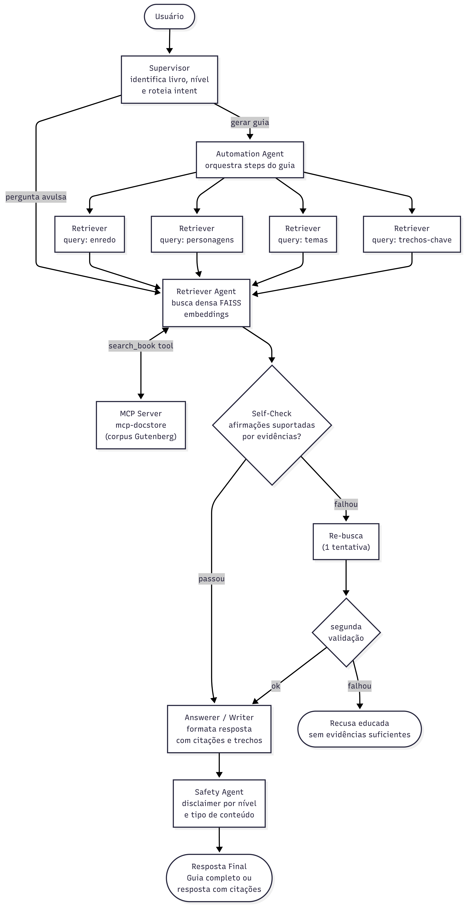

# LitGraph

## Sobre o app
O sistema tem como objetivo democratizar o acesso a obras literárias clássicas do domínio público, gerando guias de estudo personalizados de acordo com o nível do aluno ou responder perguntas avulsas com base nas obras. A ideia central é que um estudante do ensino médio, um professor preparando uma aula ou um leitor curioso possa obter, em segundos, um material estruturado sobre qualquer obra disponível no Project Gutenberg com resumo, personagens, temas, trechos-chave e perguntas de revisão, tudo embasado em evidências reais do texto original, sem alucinações.

## Usecases principais
### UC-01 — Gerar guia de estudo completo
O caso de uso principal da aplicação. O usuário informa o título da obra, o nível do aluno e o tipo de saída desejada. O sistema executa o workflow completo — recuperando trechos sobre enredo, personagens, temas e passagens-chave — e entrega um documento estruturado com citações do texto original. Exemplo: um professor do ensino médio pedindo um guia completo de Dom Casmurro para usar em sala de aula.

### UC-02 — Responder perguntas avulsas sobre uma obra
O usuário faz uma pergunta direta sobre um livro, sem precisar de um guia completo. O sistema recupera os trechos mais relevantes e responde com citações, funcionando como um assistente de leitura. Exemplo: "Quais são as principais teorias sobre a culpa de Capitu?"

## Diagrama de fluxo do app
